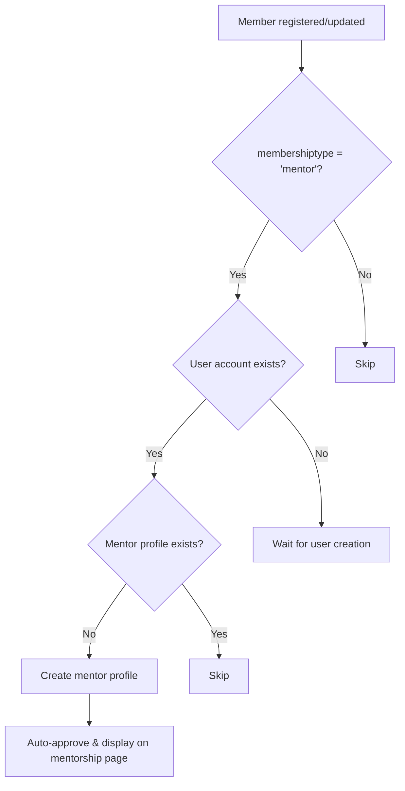

# Automatic Mentor Profile Creation

## Overview

This feature automatically creates mentor profiles for members when their `membershiptype` is set to `"mentor"` in the `members` table. The system syncs data between three tables:

- `members` - Community member registration data
- `users_user` - Django authentication users
- `mentors` - Mentor profiles for the mentorship platform

## How It Works

### Automatic Creation Flow



### Components

#### 1. Django Signals (`apps/platform/signals.py`)

Automatically triggers when:
- A new member is created with `membershiptype='mentor'`
- An existing member's `membershiptype` is updated to `'mentor'`

**Features:**
- ✅ Checks if user account exists for the member's email
- ✅ Prevents duplicate mentor profiles
- ✅ Extracts expertise from member data (`areaOfExpertise`, `industry`, `skills`)
- ✅ Generates bio from member data (`experience`, `occupation`, `jobtitle`)
- ✅ Auto-approves mentor profiles from members table

#### 2. Management Command (`python manage.py sync_mentor_profiles`)

Syncs existing members with `membershiptype='mentor'` to create their mentor profiles.

**Usage:**
```bash
# Dry run to see what would be created
python manage.py sync_mentor_profiles --dry-run

# Actually create mentor profiles
python manage.py sync_mentor_profiles

# Create without auto-approval
python manage.py sync_mentor_profiles --no-auto-approve
```

**Output:**
```
================================================================================
Sync Mentor Profiles from Members Table
================================================================================

Found 15 active members with membershiptype='mentor'

✅ Created mentor profile (ID: abc-123) for: John Doe (john@example.com)
⏭️  Skipped: Jane Smith (jane@example.com) - Mentor profile already exists
⏭️  Skipped: Bob Johnson (bob@example.com) - No user account found

================================================================================
SUMMARY
================================================================================
Total mentor members found: 15
✅ Mentor profiles created: 12
⏭️  Skipped (already exist): 2
⏭️  Skipped (no user account): 1
❌ Errors: 0

🎉 Sync completed successfully!
```

#### 3. Enhanced Supabase Client (`apps/mentorship/supabase_client.py`)

New methods:
- `get_mentors_with_member_data()` - Fetches mentors enriched with member profile data
- `sync_mentor_from_member()` - Manual sync method for creating mentor profiles

#### 4. Updated Mentorship Views (`apps/mentorship/views.py`)

The mentor list endpoint now returns enriched data including:
- User information (email, first_name, last_name)
- Member profile data (country, city, linkedin, experience, skills, etc.)
- Mentor-specific data (bio, expertise, rating, total_sessions)

## Data Mapping

### From Members to Mentors

| Members Field | Mentors Field | Notes |
|--------------|---------------|-------|
| email → users_user.email | user_id | Via user lookup |
| areaOfExpertise | expertise[] | Added to expertise array |
| industry | expertise[] | Added to expertise array |
| skills | expertise[] | First 3 skills added |
| experience + occupation + jobtitle | bio | Combined into bio text |
| - | is_approved | Set to `true` by default |
| - | rating | Initialized to `0.00` |
| - | total_sessions | Initialized to `0` |

## API Endpoints

### List All Mentors
```
GET /api/v1/mentorship/mentors/
```

**Response:**
```json
{
  "results": [
    {
      "id": "abc-123-def",
      "user_id": 42,
      "bio": "Experience: 5+ years | Occupation: Software Engineer | Job Title: Senior Developer",
      "expertise": ["Software Engineering", "Technology", "Python", "Django"],
      "rating": 4.5,
      "total_sessions": 15,
      "is_approved": true,
      "user": {
        "id": 42,
        "email": "mentor@example.com",
        "first_name": "John",
        "last_name": "Doe",
        "full_name": "John Doe"
      },
      "member": {
        "name": "John Doe",
        "country": "USA",
        "city": "New York",
        "linkedin": "https://linkedin.com/in/johndoe",
        "experience": "5+ years",
        "areaOfExpertise": "Software Engineering",
        "school": "MIT",
        "occupation": "Software Engineer",
        "jobtitle": "Senior Developer",
        "industry": "Technology",
        "skills": "Python, Django, React"
      }
    }
  ],
  "count": 25,
  "page": 1,
  "page_size": 12
}
```

## Testing

### Manual Testing

1. **Test automatic creation for new members:**
```bash
python test_mentor_auto_creation.py
```

2. **Test sync for existing members:**
```bash
# Preview what will be created
python manage.py sync_mentor_profiles --dry-run

# Create mentor profiles
python manage.py sync_mentor_profiles
```

3. **Verify in Supabase:**
- Check the `mentors` table for new entries
- Verify `user_id` matches `users_user.id`
- Confirm `is_approved = true`

4. **Test API endpoint:**
```bash
# Get all mentors
curl http://localhost:8000/api/v1/mentorship/mentors/

# Filter by expertise
curl http://localhost:8000/api/v1/mentorship/mentors/?expertise=Engineering

# With pagination
curl http://localhost:8000/api/v1/mentorship/mentors/?page=1&page_size=10
```

### Expected Behavior

✅ **When a member is created with membershiptype='mentor':**
- System automatically creates a mentor profile
- Mentor profile is auto-approved
- Bio and expertise are populated from member data
- Mentor appears on mentorship page immediately

✅ **When membershiptype is updated to 'mentor':**
- Signal detects the change
- Creates mentor profile if it doesn't exist
- Skips if mentor profile already exists

✅ **For existing members:**
- Run `sync_mentor_profiles` command
- Creates profiles for all mentor members without profiles
- Logs detailed information about each operation

## Troubleshooting

### Issue: Mentor profile not created

**Check:**
1. Does the member have a user account?
   ```sql
   SELECT * FROM users_user WHERE email = 'member@example.com';
   ```

2. Check if membershiptype is exactly 'mentor' (case-insensitive):
   ```sql
   SELECT membershiptype FROM members WHERE email = 'member@example.com';
   ```

3. Check Django logs:
   ```bash
   tail -f logs/django.log | grep mentor
   ```

### Issue: Duplicate mentor profiles

The signal includes duplicate prevention logic. If you see duplicates:
1. Check the `mentors.user_id` unique constraint
2. Review signal logs for errors

### Issue: Missing member data in API response

If `member` field is `null` in API:
1. Verify member email matches user email exactly
2. Check `members` table has data for that email
3. Review Supabase client logs

## Database Schema

### Members Table
```sql
CREATE TABLE members (
  id UUID PRIMARY KEY,
  email TEXT NOT NULL,
  name TEXT NOT NULL,
  membershiptype TEXT NOT NULL,  -- 'mentor', 'mentee', 'student', etc.
  areaOfExpertise TEXT,
  skills TEXT,
  experience TEXT,
  occupation TEXT,
  jobtitle TEXT,
  industry TEXT,
  ...
);
```

### Mentors Table
```sql
CREATE TABLE mentors (
  id UUID PRIMARY KEY,
  user_id INTEGER UNIQUE REFERENCES users_user(id),
  bio TEXT,
  expertise JSONB DEFAULT '[]',
  is_approved BOOLEAN DEFAULT false,
  rating NUMERIC(3,2) DEFAULT 0.00,
  total_sessions INTEGER DEFAULT 0,
  version INTEGER DEFAULT 1,
  created_at TIMESTAMPTZ DEFAULT NOW(),
  updated_at TIMESTAMPTZ DEFAULT NOW()
);
```

## Configuration

### Signal Registration

Signals are automatically registered in `apps/platform/apps.py`:

```python
class PlatformConfig(AppConfig):
    def ready(self):
        import apps.platform.signals  # noqa
```

### Auto-Approval Setting

By default, mentors created from the members table are auto-approved. To change this:

```python
# In signals.py, line ~85
is_approved = True  # Change to False to require manual approval
```

## Maintenance

### Regular Sync

Set up a cron job to sync new mentor members regularly:

```bash
# Every day at 2 AM
0 2 * * * cd /path/to/mansa-backend && python manage.py sync_mentor_profiles
```

### Monitoring

Monitor these metrics:
- Members with membershiptype='mentor' vs mentor profiles
- Failed mentor profile creations (check logs)
- Members without user accounts

Query for monitoring:
```sql
-- Members with membershiptype='mentor' but no mentor profile
SELECT m.email, m.name 
FROM members m
LEFT JOIN users_user u ON m.email = u.email
LEFT JOIN mentors mt ON u.id = mt.user_id
WHERE LOWER(m.membershiptype) = 'mentor'
  AND m.is_active = true
  AND mt.id IS NULL;
```

## Support

For issues or questions:
1. Check logs: `tail -f logs/django.log`
2. Run test script: `python test_mentor_auto_creation.py`
3. Review signal code: `apps/platform/signals.py`
4. Contact the development team
